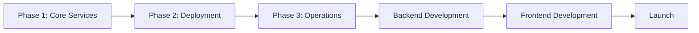

# TIH Project Gantt Chart & Progress Tracker

**Last Updated:** 2025-11-13
**Project Status:** 📋 Planning → 🔧 Infrastructure Setup
**Current Phase:** Phase 1 - Core Services

---

## Project Timeline Overview

```
Week 1-2: Infrastructure Setup (GCP Managed Services)
├─ Phase 1: Core Services (Days 1-2)       [●●●○○○○○○○] 30%
├─ Phase 2: Deployment (Day 3)             [○○○○○○○○○○]  0%
└─ Phase 3: Operations (Day 4)             [○○○○○○○○○○]  0%

Week 3-4: Backend Development
├─ Database Schema Implementation          [○○○○○○○○○○]  0%
├─ MISP Integration & Feed Ingestion       [○○○○○○○○○○]  0%
├─ CPE Matching Engine                     [○○○○○○○○○○]  0%
└─ Translation Engine (GPT-4)              [○○○○○○○○○○]  0%

Week 5-6: Core Features
├─ User Authentication (Auth0)             [○○○○○○○○○○]  0%
├─ Device Catalog (100 devices)            [○○○○○○○○○○]  0%
├─ Daily Digest Email System               [○○○○○○○○○○]  0%
└─ Proof Tracking                          [○○○○○○○○○○]  0%

Week 7-8: Frontend & Testing
├─ React Dashboard                         [○○○○○○○○○○]  0%
├─ API Integration                         [○○○○○○○○○○]  0%
├─ Beta Testing (20 users)                 [○○○○○○○○○○]  0%
└─ Bug Fixes & Iteration                   [○○○○○○○○○○]  0%

Week 9-12: Launch & Growth
├─ Product Hunt Launch                     [○○○○○○○○○○]  0%
├─ Growth Tactics                          [○○○○○○○○○○]  0%
└─ Monetization (Stripe)                   [○○○○○○○○○○]  0%
```

---

## Detailed Phase Tracking

### **PHASE 1: Core Services (2-3 hours)** 🔧 IN PROGRESS

**Target Completion:** Day 1-2
**Dependencies:** None
**Blocking:** All subsequent phases

| Step | Task | Status | Time | Notes |
|------|------|--------|------|-------|
| 0.1 | Install gcloud CLI | ⏸️ Not Started | 10 min | Prerequisite |
| 0.2 | Create GCP project | ⏸️ Not Started | 5 min | Project ID: tih-production |
| 0.3 | Enable APIs (11 services) | ⏸️ Not Started | 5 min | compute, sql, run, redis, etc. |
| 0.4 | Set default region | ⏸️ Not Started | 2 min | us-central1 recommended |
| 1.1 | Create VPC network | ⏸️ Not Started | 5 min | tih-vpc |
| 1.2 | Create private subnet | ⏸️ Not Started | 5 min | 10.0.0.0/24 range |
| 1.3 | Create VPC connector | ⏸️ Not Started | 5 min + 5 min wait | For Cloud Run → SQL |
| 2.1 | Create secrets (5 keys) | ⏸️ Not Started | 10 min | OpenAI, SendGrid, etc. |
| 2.2 | Create service account | ⏸️ Not Started | 5 min | tih-api SA |
| 2.3 | Grant IAM permissions | ⏸️ Not Started | 5 min | Secret access |
| 3.1 | Create Cloud SQL instance | ⏸️ Not Started | 5 min + 15 min wait ⏰ | db-custom-2-7680 |
| 3.2 | Create database & user | ⏸️ Not Started | 5 min | tih_db database |
| 3.3 | Save connection string | ⏸️ Not Started | 5 min | To Secret Manager |
| 3.4 | Test local connection | ⏸️ Not Started | 10 min | Via Cloud SQL Proxy |
| 4.1 | Create Redis instance | ⏸️ Not Started | 5 min + 15 min wait ⏰ | 1GB Standard HA |
| 4.2 | Save Redis URL | ⏸️ Not Started | 5 min | To Secret Manager |

**Phase 1 Progress:** 0/16 tasks complete (0%)
**Estimated Time Remaining:** 2-3 hours
**Blockers:** None

---

### **PHASE 2: Deployment (1-2 hours)** ⏸️ PENDING

**Target Completion:** Day 3
**Dependencies:** Phase 1 complete
**Blocking:** Backend development

| Step | Task | Status | Time | Notes |
|------|------|--------|------|-------|
| 5.1 | Create storage buckets (3) | ⏸️ Not Started | 10 min | Backups, uploads, assets |
| 5.2 | Set IAM permissions | ⏸️ Not Started | 5 min | Grant SA access |
| 6.1 | Create Artifact Registry | ⏸️ Not Started | 5 min | Docker repo |
| 6.2 | Configure Docker auth | ⏸️ Not Started | 5 min | gcloud auth configure-docker |
| 7.1 | Create App Engine app | ⏸️ Not Started | 5 min | Required for Scheduler |
| 7.2 | Create scheduler jobs | ⏸️ Not Started | 10 min | Daily digest, follow-ups |
| 9.1 | Create Dockerfile | ⏸️ Not Started | 15 min | FastAPI container |
| 9.2 | Deploy to Cloud Run | ⏸️ Not Started | 10 min + 5 min build | Initial deployment |
| 9.3 | Test /health endpoint | ⏸️ Not Started | 5 min | Verify deployment |

**Phase 2 Progress:** 0/9 tasks complete (0%)
**Estimated Time Remaining:** 1-2 hours
**Blockers:** Phase 1 must complete first

---

### **PHASE 3: Operations (2-3 hours)** ⏸️ PENDING

**Target Completion:** Day 4
**Dependencies:** Phase 2 complete
**Blocking:** Production readiness

| Step | Task | Status | Time | Notes |
|------|------|--------|------|-------|
| 8.1 | Create MISP VM | ⏸️ Not Started | 10 min + 10 min wait ⏰ | e2-standard-4 |
| 8.2 | Configure MISP | ⏸️ Not Started | 30 min | Docker setup |
| 8.3 | Add CISA KEV feed | ⏸️ Not Started | 15 min | First threat feed |
| 8.4 | Save MISP API key | ⏸️ Not Started | 5 min | To Secret Manager |
| 10.1 | Create uptime checks | ⏸️ Not Started | 10 min | Monitor API health |
| 10.2 | Create notification channel | ⏸️ Not Started | 5 min | Email alerts |
| 10.3 | Create alert policies | ⏸️ Not Started | 10 min | API down, errors |
| 11.1 | Set up Cloud Armor | ⏸️ Not Started | 15 min | DDoS protection (optional) |
| 12.1 | Configure DB backups | ⏸️ Not Started | 5 min | Already auto-configured |
| 12.2 | Create export script | ⏸️ Not Started | 10 min | Weekly exports |

**Phase 3 Progress:** 0/10 tasks complete (0%)
**Estimated Time Remaining:** 2-3 hours
**Blockers:** Phase 2 must complete first

---

## Infrastructure Setup Summary

**Total Tasks:** 35
**Completed:** 0 (0%)
**In Progress:** 0
**Not Started:** 35

**Total Estimated Time:** 5-7 hours
**Time Spent:** 0 hours
**Time Remaining:** 5-7 hours

---

## Critical Path



**Current Bottleneck:** Phase 1 Step 0.1 (Install gcloud CLI)

---

## Cost Tracking

| Service | Configuration | Monthly Cost | Status |
|---------|--------------|--------------|--------|
| Cloud SQL | db-custom-2-7680 (HA) | $75 | ⏸️ Not deployed |
| Redis | 1GB Standard HA | $65 | ⏸️ Not deployed |
| MISP VM | e2-standard-4 | $80 | ⏸️ Not deployed |
| Cloud Run | min-instances=1 | $7 | ⏸️ Not deployed |
| VPC Connector | 2-10 instances | $9 | ⏸️ Not deployed |
| Cloud Storage | 100GB | $5 | ⏸️ Not deployed |
| Others | Secret Manager, etc. | $2 | ⏸️ Not deployed |
| **TOTAL** | | **$243/mo** | **$0/mo currently** |

**Budget Status:** Not yet spending (pre-deployment)

---

## Risk Register

| Risk | Impact | Probability | Mitigation | Status |
|------|--------|-------------|------------|--------|
| API quota limits | HIGH | Medium | Request increase early | ⚠️ Monitor |
| Cloud SQL takes 20+ min | Medium | Low | Start early in session | ℹ️ Known |
| Permission errors | Medium | High | Follow IAM steps exactly | ⚠️ Monitor |
| Cost overrun | HIGH | Low | Start with MVP tier ($86/mo) | ✅ Planned |
| MISP setup fails | Medium | Medium | Use NVD API as backup | ℹ️ Known |

---

## Next Actions

**Immediate (Phase 1):**
1. ⏭️ Install gcloud CLI on local machine
2. ⏭️ Create GCP project "tih-production"
3. ⏭️ Enable 11 required APIs
4. ⏭️ Get OpenAI & SendGrid API keys ready

**Up Next (Phase 2):**
- Deploy minimal FastAPI app to Cloud Run
- Test database connectivity

**Later (Phase 3):**
- Set up MISP threat intelligence platform
- Configure monitoring and alerting

---

## Session Planning

### **Session 1: Core Infrastructure (2-3 hours)**
- **Goal:** Complete Phase 1
- **Outcome:** Database and cache running
- **Validation:** Can connect to Cloud SQL from laptop

### **Session 2: Deployment (1-2 hours)**
- **Goal:** Complete Phase 2
- **Outcome:** Cloud Run API deployed
- **Validation:** `curl https://tih-api.run.app/health` returns 200

### **Session 3: Operations (2-3 hours)**
- **Goal:** Complete Phase 3
- **Outcome:** MISP + monitoring configured
- **Validation:** Production-ready infrastructure

---

## Update Log

| Date | Phase | Completed Tasks | Notes |
|------|-------|----------------|-------|
| 2025-11-13 | Planning | Created Gantt chart | Ready to start Phase 1 |
| | | | |
| | | | |

---

**Status Legend:**
- ✅ Complete
- 🔧 In Progress
- ⏸️ Not Started
- ⚠️ Blocked
- ❌ Failed (needs retry)

**Time Estimates:**
- Actual hands-on work time (not including wait times)
- Wait times marked with ⏰
- Total = work time + wait time
